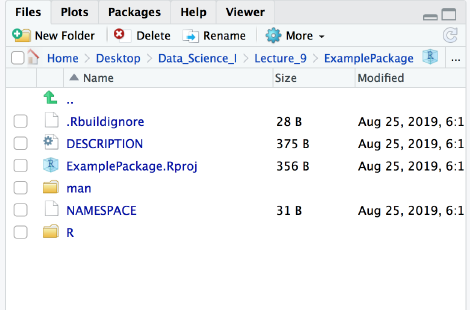
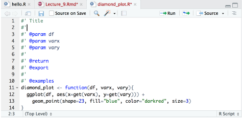

```{r setup, include=FALSE}
knitr::opts_chunk$set(cache=TRUE, tidy=FALSE,error=FALSE, message=FALSE, warning=FALSE, tidy.opts=list(width.cutoff=60))
```

### Introduction

R Packages are the fundamental units of reproducible R code. They include:  

* reusable R functions
* the documentation that describes how to use them
* sample data

You can make an R package to share code with other people or as a resource just for yourself with functions that you frequently use.

The following is a step-by-step guide to creating your own R package.

### Step by step

To create a new package in RStudio go to File >> New Project. Select to make a new project in a new directory.

```{r, out.width = '30%', fig.align="center", echo = FALSE}
library(knitr)

```

Select the project type as an R Package.  

```{r, out.width = '30%', fig.align="center", echo = FALSE}

```

Name the R Package, select the working directory that the R package will live in, and click ‘Create Package’.

```{r, out.width = '30%', fig.align="center", echo = FALSE}

```


Now go to the directory and checkout what you have!  


```{r, out.width = '30%', fig.align="center", echo = FALSE}

```


You can see the same thing inside of RStudio:

```{r, out.width = '30%', fig.align="center", echo = FALSE}

```

Click on the R folder in R studio. There is a sample function in here called ‘hello.R’. We won’t be using this function and instead are going to write our own function!


```{r, out.width = '30%', fig.align="center", echo = FALSE}

```

Go to File >> New File >> R Script. In this R Script we will write a function for our package, for example:

```{r}
diamond_plot <- function(df, varx, vary){
ggplot(df, aes(x=get(varx), y=get(vary))) +
  geom_point(shape=23, fill="blue", color="darkred", size=3)
}
```

Once we are done writing the function, we will save this R Script as diamond_plot.R in the R folder of our package.  


```{r, out.width = '30%', fig.align="center", echo = FALSE}

```

Then library the following two packages:

```{r}
library(devtools)
library(roxygen2)
```

Now run the following code in the same working directory as the package (you should by default be in this directory after creating the package), namely the console window inside the .Rproj

```{r，eval = FALSE}
document()
setwd('..')
install('ExamplePackage')
```

So far We have installed the package, but our package has no documentation!

While you have the script diamond_plot.R open, go to Code >> Insert Roxygen Skeleton (attention: the mouse should place in the function)

```{r, out.width = '30%', fig.align="center", echo = FALSE}

```

This will add documentation to your function. Fill in the documentation:


```{r, out.width = '30%', fig.align="center", echo = FALSE}

```

Clean up your package and delete the hello.R function.


Go up a level to find the DESCRIPTION file.

```{r, out.width = '30%', fig.align="center", echo = FALSE}

```

Click on the DESCRIPTION file. Edit the DESCRIPTION file.

```{r, out.width = '30%', fig.align="center", echo = FALSE}
include_graphics("image/11.png")
```

You can also add data to your package. Make a data folder:  

```{r, out.width = '30%', fig.align="center", echo = FALSE}

```

Install and check the packages. Run the following code in the same working directory as the package.  
```{r，eval = FALSE}
document()
setwd('..')
install('ExamplePackage')
```

Now we will put the package up on Github. Make a new repository with the same name as your package. Make this repository public! Add your package to Github like we typically do. One useful
command is: git add *, this will add everything in the folder instead of having to add each thing individually.

```{r，eval = FALSE}
devtools::install_github('emsweene/ExamplePackage')
```

You can now install the package from Github or give it to a friend to use!